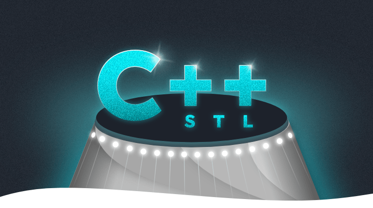

<div id="top"></div>
<p align=center>
  
  
  
</p>

<!-- PROJECT LOGO -->
<br />
<div align="center">
  <a>
   
  </a>
</div>

<!-- TABLE OF CONTENTS -->
  <summary>Table of Contents</summary>
  <ol>
   <li>
    <a href="#about-the-project">About The Project</a>
    <ul>
      <li><a href="#built-with">Built With</a></li>
    </ul>
   </li>
   <li>
    <a href="#getting-started">Getting Started</a>
    <ul>
      <li><a href="#prerequisites">Prerequisites</a></li>
      <li><a href="#installation">Installation</a></li>
    </ul>
   </li>
   <li><a href="#usage">Usage</a></li>
   <li><a href="#roadmap">Roadmap</a></li>
   <li><a href="#contact">Contact</a></li>
   <li><a href="#acknowledgments">Acknowledgments</a></li>
  </ol>

<!-- ABOUT THE PROJECT -->
## About The Project

ft_containers is a 42 project, aiming to recreate some Standard Template Library (STL) containers in C++, compliant with C++98 standard.

4 containers have been recreated : Vector, Map, Set, and Stack.

Full subject can be found <a href="/docs">here</a>

### Built With

* [C++](https://en.wikipedia.org/wiki/C%2B%2B)

<!-- GETTING STARTED -->
## Getting Started

### Prerequisites

* [gcc](https://gcc.gnu.org/)
* [make](https://www.gnu.org/software/make/)

### Installation

* Clone the repo

  ```sh
  git clone https://github.com/kema-dev/ft_containers.git
  ```

* Build the project using make

  ```sh
  make
  ```

<!-- USAGE EXAMPLES -->
## Usage

* Launch the program

```sh
./bin/ft_containers.out
```

* You can also use `diff.sh` to compare our program output compared to STL one

```sh
./diff.sh
```

<!-- ROADMAP -->
## Roadmap

* The project is finished and no further work is planned on it

See the [open issues](https://github.com/kema-dev/ft_containers/issues) for a full list of proposed features (and known issues).

<!-- CONTACT -->
## Contact

We are two creators :

kema-dev - [GitHub](https://github.com/kema-dev)

dorianginisty - [GitHub](https://github.com/dorianginisty)

## Acknowledgments

* [Img Shields](https://shields.io)
* [README.MD-Template](https://github.com/othneildrew/Best-README-Template)
