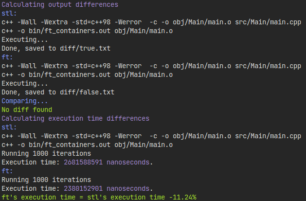

<div id="top"></div>
<p align=center>
  
  
  
</p>

<!-- PROJECT LOGO -->
<br />
<div align="center">
  <a>
   
  </a>
</div>

<!-- ABOUT THE PROJECT -->
## About The Project

**ft_containers** is a 42 project, aiming to recreate some Standard Template Library (STL) containers in C++, compliant with C++98 standard.

4 containers have been recreated : Vector, Map, Set, and Stack.

Full subject can be found <a href="/docs">here</a>

### Built With

* [C++](https://en.wikipedia.org/wiki/C%2B%2B)

<!-- GETTING STARTED -->
## Getting Started

### Prerequisites

* [gcc](https://gcc.gnu.org/)
* [make](https://www.gnu.org/software/make/)

### Installation

* Clone the repo

  ```sh
  git clone https://github.com/kema-dev/ft_containers.git
  ```

* Build the project using make

  ```sh
  make
  ```

<!-- USAGE EXAMPLES -->
## Usage

* Launch the program

```sh
./bin/ft_containers.out
```

* You can also use `correct.sh` to compare my program to STL's one

```sh
./correct.sh
```

<!-- CONTACT -->
## Contact

kema-dev - [GitHub](https://github.com/kema-dev)

## Acknowledgments

* [Img Shields](https://shields.io)
* [README.MD-Template](https://github.com/othneildrew/Best-README-Template)
